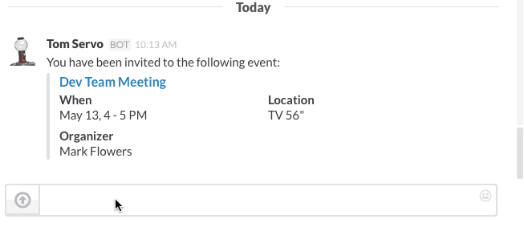

## Hubot-Slack Google Calendar

Provides commands for creating & responding to events in Google Calendar, as well as checking resource status and booking resources. It also has the ability to remind users of upcoming events and notifying users when their events are updated.



## Configuration

This script depends on the [hubot-slack-google-auth](https://github.com/Skookum/hubot-slack-google-auth) script, which should com first in your `external-scripts.json` file. In addition to the environment variables described there, make sure `HUBOT_GOOGLE_SCOPES` variable contains `https://www.googleapis.com/auth/calendar`.

Enable the Google Calendar API in the [Google Developers Console](https://console.developers.google.com).

### Webhooks

Calendar reminders & event updates depend on [push notifications](https://developers.google.com/google-apps/calendar/v3/push). For these to work, you'll need to register the domain of your hubot instance (should be the same as the `HUBOT_URL` env variable) in the developer console and verify ownership using webmaster tools. Whenever someone enables calendar reminders, the script will handle creating and renewing the webhook.

### Resources

You can also query and book resources using this script by putting a `calendar-resources.json` file in your hubot's root directory. The format looks like this:

```js
{
  // Key is the name of the "group" this resource belongs to, used in commands like:
  // "hubot what team rooms are available"
  "team room": {
    // Resource ID                                      // array of aliases for this resource
    "yourteam.com_abc123@resource.calendar.google.com": ["1 - HAL 9000", "team room 1", "team room one", "tr1", "tr 1"]
  },
  // ...
}
```

## Usage

### Creating events

- `hubot create event <quick add text>` - create a new event on your primary calendar using the given [quick add text](https://developers.google.com/google-apps/calendar/v3/reference/events/quickAdd).
- `hubot book <resource> for <quick add text>` - creates an event (as above) and invites the given resource. Requires adding a `calendar-resources.json` file as described above. Resource name for this command can be any one of the aliases you defined.

### Enable reminders

- `hubot enable calendar reminders` - enable reminders for upcoming events and notifications when events are added/changed/removed. All reminders are sent via DM. Behind the scenes this sets up a webhook that will notify hubot whenever events are updated.
- `hubot disable calendar reminders` - turns off event reminders and updates

### Replying to events

Whenever hubot send you an event (after creating it, in a reminder, etc.) you can send the following commands to act on it:

- `hubot reply <yes/no/maybe>` - RSVP to the event (if you're invited)
- `hubot invite <list of slack names>` - invites the given Slack user(s) to the event

### Querying resources

- `hubot what <resource group>s are available` - tells you which resources in the given group (if any) are free for the next hour.
